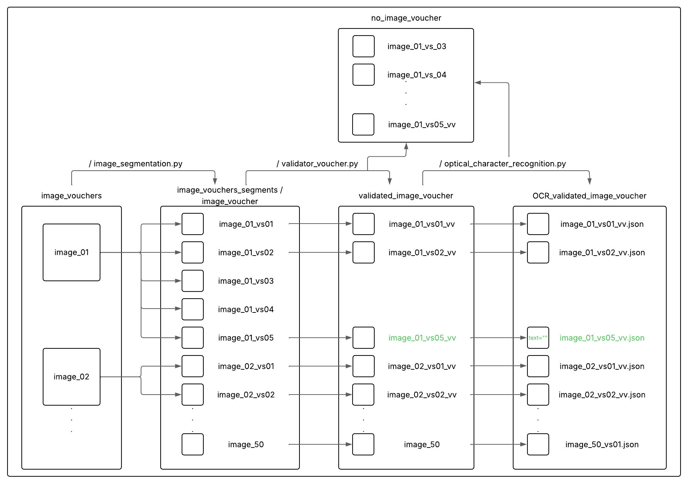

# Proyecto de Procesamiento de Vouchers

Este proyecto es una aplicación Python diseñada para procesar imágenes de vouchers (comprobantes o recibos) a través de un pipeline que incluye segmentación de los vouchers dentro de una imagen más grande, validación de si los segmentos son realmente vouchers, y extracción de texto mediante OCR.



## Características Principales

- **Segmentación de Vouchers**: Identifica y extrae las áreas correspondientes a vouchers de una imagen de entrada. Actualmente utiliza el modelo SAM (Segment Anything Model).
- **Validación de Vouchers**: Verifica si un segmento de imagen es probablemente un voucher. Actualmente utiliza un modelo CLIP.
- **Extracción de Texto (OCR)**: Extrae el texto de los vouchers validados. Soporta múltiples motores de OCR (Tesseract, Donut, AWS Textract) mediante un patrón Strategy.
- **Configurable**: El comportamiento del pipeline y los modelos se pueden configurar a través de un archivo `config/settings.yml`.
- **Diseño Modular**: El código está estructurado siguiendo principios SOLID y utiliza patrones de diseño como Strategy y Factory para mejorar la flexibilidad y mantenibilidad. Se han incorporado también elementos de estilo funcional en áreas clave.
- **Logging Detallado**: El sistema cuenta con un logging configurable para rastrear el flujo de ejecución y facilitar la depuración. Los mensajes de log están en español.

## Estructura del Proyecto

- `main.py`: Punto de entrada principal para ejecutar el pipeline de procesamiento de vouchers.
- `scr/`: Contiene el código fuente principal.
  - `pipeline/voucher_pipeline.py`: Orquesta el flujo de segmentación, validación y OCR.
  - `segmentation/`: Lógica para la segmentación de imágenes.
    - `isegmenter.py`: Interfaz para los segmentadores.
    - `voucher_segmentation.py` (clase `SamSegmenter`): Implementación con SAM. Contiene la función auxiliar `_procesar_mascara_individual` para el filtrado funcional de máscaras.
    - `segmenter_factory.py`: Factoría para crear instancias de segmentadores.
  - `validation/`: Lógica para la validación de vouchers.
    - `ivalidator.py`: Interfaz para los validadores.
    - `voucher_validation.py` (clase `ClipValidator`): Implementación con CLIP. Incluye el método estático `_evaluar_probabilidades` para la lógica de decisión.
    - `validator_factory.py`: Factoría para crear instancias de validadores.
  - `ocr/`: Lógica para la extracción de texto (OCR).
    - `iocrextractor.py`: Interfaz para los extractores de OCR.
    - `voucher_ocr.py` (clase `OCRExtractor`): Implementación que gestiona múltiples estrategias de OCR. Su método `preprocesar_imagen` es estático.
    - `ocr_extractor_factory.py`: Factoría para crear instancias de extractores de OCR.
  - `utils/`: Módulos de utilidad.
    - `config_loader.py`: Carga de configuración.
    - `logger.py`: Configuración del logger.
    - `text_processing.py`: Funciones puras para la limpieza y transformación de texto.
- `config/settings.yml`: Archivo de configuración para el pipeline (rutas, modelos, umbrales, configuración de logging, etc.).
- `data/`: Directorios para datos de entrada y salida.
  - `data/input/`: Imágenes de entrada que pueden contener vouchers. (Este es un ejemplo, la ruta se configura en `settings.yml`)
  - `data/vouchers_a_segmentar/`: Directorio de entrada para el pipeline principal.
  - `data/single_voucher/`: Almacena segmentos individuales antes de la validación.
  - `data/validated_voucher/`: Almacena vouchers validados.
  - `data/no_voucher/`: Almacena segmentos que no fueron validados como vouchers.
  - `data/outputs/`: Almacena los resultados del OCR en formato JSON (incluyendo texto crudo y limpio).
- `tests/`: Contiene las pruebas automáticas.

## Configuración

1.  **Clonar el Repositorio**:
    ```bash
    git clone <url_del_repositorio>
    cd <nombre_del_repositorio>
    ```
2.  **Instalar Dependencias**:
    Asegúrate de tener Python 3.8+ instalado. Las dependencias principales incluyen `torch`, `transformers`, `Pillow`, `opencv-python`, `pytesseract`, `segment-anything`, `PyYAML`, `boto3` (si usas Textract). Se recomienda usar un entorno virtual:

    ```bash
    python -m venv venv
    source venv/bin/activate  # En Windows: venv\Scripts\activate
    pip install -r requirements.txt
    ```

    _Nota: La instalación de `torch` puede variar según tu sistema y si tienes GPU. Consulta la [página oficial de PyTorch](https://pytorch.org/)._
    _Si usas Tesseract OCR, asegúrate de que esté instalado en tu sistema y accesible en el PATH._

3.  **Configurar `config/settings.yml`**:
    - Ajusta las rutas de los directorios (`paths`).
    - Configura los modelos para segmentación (`segmentation`), validación (`validation`), y el método de OCR (`ocr`).
    - Si usas AWS Textract, configura tus credenciales de AWS.
    - Ajusta la configuración de `logging` (`log_file`, `log_level`) según tus necesidades.

## Uso

Para ejecutar el pipeline principal de procesamiento de vouchers:

```bash
python main.py
```

Las imágenes a procesar deben colocarse en el directorio especificado en `config/settings.yml` bajo `paths.vouchers_a_segmentar`. Los resultados se guardarán en los directorios de salida configurados. Los logs se guardarán según lo especificado en la sección `logging` de `config/settings.yml`.

## Logging

El proyecto utiliza el módulo `logging` de Python para registrar información sobre su ejecución. Los mensajes de log están en español.

**Configuración del Logging:**
La configuración del logging se gestiona a través de la sección `logging` en el archivo `config/settings.yml`. Puedes ajustar:

- `log_file`: La ruta al archivo donde se guardarán los logs (ej. `outputs/logs/pipeline.log`).
- `log_level`: El nivel de detalle de los logs (ej. `INFO`, `DEBUG`, `WARNING`, `ERROR`).

```yaml
# Ejemplo de sección de logging en config/settings.yml
logging:
  log_file: "outputs/logs/pipeline.log"
  log_level: "INFO"
```

> [!TIP]
> Para una depuración más detallada, puedes cambiar `log_level` a `DEBUG` en `config/settings.yml` para ver mensajes de log adicionales.

## Principios de Diseño Aplicados

- **SOLID**:
  - **S**ingle Responsibility Principle: Cada clase tiene una responsabilidad bien definida.
  - **O**pen/Closed Principle: El uso de interfaces y factorías facilita la extensión con nuevas estrategias sin modificar el núcleo.
  - **L**iskov Substitution Principle: Las implementaciones de las interfaces son sustituibles.
  - **I**nterface Segregation Principle: Interfaces específicas para cada rol.
  - **D**ependency Inversion Principle: Los módulos de alto nivel dependen de abstracciones, con dependencias inyectadas.
- **Patrones de Diseño**:
  - **Strategy**: Utilizado en `OCRExtractor` para seleccionar dinámicamente el motor de OCR. Las bases para este patrón también están en `SamSegmenter` y `ClipValidator`.
  - **Factory**: `SegmenterFactory`, `ValidatorFactory`, y `OCRExtractorFactory` encapsulan la creación de instancias de los componentes del pipeline.
- **Mejoras con Estilo Funcional**:
  Se han aplicado principios de programación funcional en áreas específicas para mejorar la claridad, modularidad y testeabilidad del código:
  - **Limpieza de Texto OCR**:
    - El módulo `scr/utils/text_processing.py` contiene funciones puras (ej. `remover_espacios_extra`, `convertir_a_minusculas`) para procesar el texto extraído por el OCR.
    - `VoucherPipeline` utiliza estas funciones, y el JSON de salida ahora incluye tanto el texto original (`raw_text`) como el texto procesado (`cleaned_text`).
      > [!TIP]
      > Este enfoque hace que la lógica de limpieza de texto sea independiente, fácil de probar y modificar sin afectar otras partes del pipeline.
  - **Procesamiento de Segmentos en `SamSegmenter`**:
    - La lógica para validar y procesar cada máscara de segmentación individual se ha extraído a una función auxiliar (`_procesar_mascara_individual`) dentro de `voucher_segmentation.py`.
    - Esta función opera de manera más funcional, tomando los datos de la máscara y devolviendo un resultado (el segmento procesado o `None`) sin depender del estado de la instancia `SamSegmenter` para la decisión de filtrado.
      > [!NOTE]
      > Esto simplifica el método principal `SamSegmenter.segment` y facilita las pruebas de la lógica de filtrado de máscaras.
  - **Métodos Estáticos para Lógica Pura**:
    - `OCRExtractor.preprocesar_imagen`: Se convirtió en un método estático, ya que su lógica de transformación de imagen no depende del estado de la instancia.
    - `ClipValidator._evaluar_probabilidades`: La sub-lógica para evaluar las probabilidades del modelo contra un umbral se extrajo a un método estático, aislando la decisión pura.
